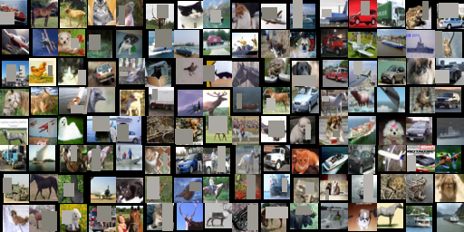
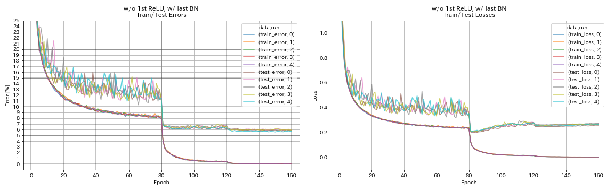
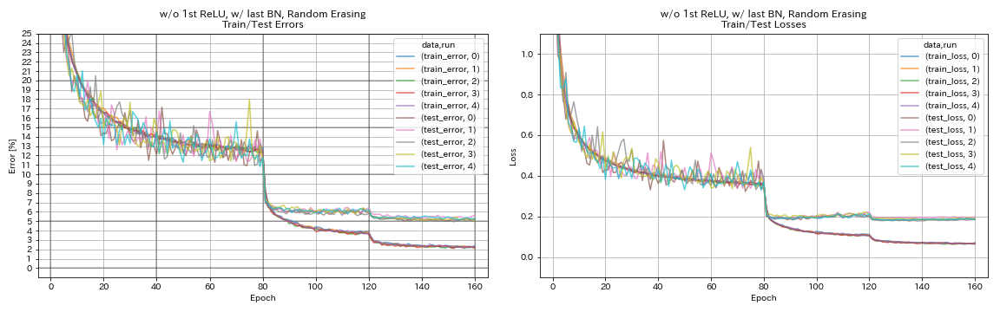

# PyTorch Implementation of RandomErasing



## Usage

```
$ python main.py --block_type basic --depth 110 --use_random_erase --random_erase_prob 0.5 --random_erase_area_ratio_range '[0.02, 0.4]' --random_erase_min_aspect_ratio 0.3 --random_erase_max_attempt 20 --outdir results
```


## Results on CIFAR-10

| Model                              | Test Error (median of 5 runs) | Training Time |
|:-----------------------------------|:-----------------------------:|--------------:|
| ResNet-preact-56 w/o RandomErasing | 5.85                          |    98 min     |
| ResNet-preact-56 w/ RandomErasing  | 5.22                          |    98 min     |

### w/o RandomErasing
```
$ python -u main.py --depth 56 --block_type basic --base_lr 0.2 --seed 7 --outdir results/wo_random_erasing/00
```



### w/ RandomErasing
```
$ python -u main.py --depth 56 --block_type basic --base_lr 0.2 --use_random_erase --seed 7 --outdir results/w_random_erasing/00
```




## References

* Zhong, Zhun, et al. "Random Erasing Data Augmentation." arXiv preprint arXiv:1708.04896 (2017). [arXiv:1708.04896]( https://arxiv.org/abs/1708.04896 ), [PyTorch implementation]( https://github.com/zhunzhong07/Random-Erasing )


